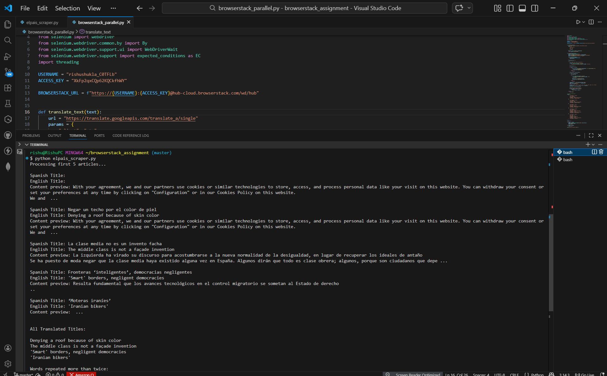
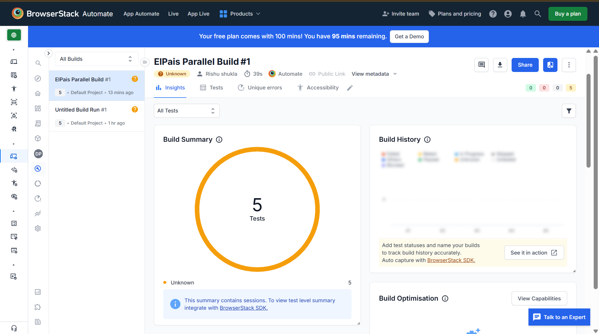
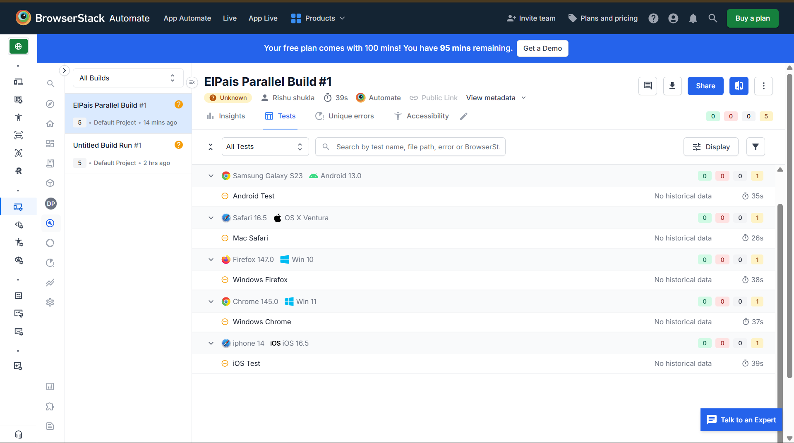

**El País Selenium Automation & Cross-Browser Testing**


Stack: Python 3.14, Selenium WebDriver, BrowserStack, Deep-Translator

## 📌 Project Overview
This project automates the extraction and analysis of opinion articles from the Spanish news outlet El País. It demonstrates advanced automation techniques including:

* Web Scraping: Handling dynamic cookie banners and extracting content/images.

* API Integration: Translating Spanish headers to English using the Google Translate engine via ```deep-translator```.

* Data Analysis: Frequency analysis of translated headers.

* Parallel Cloud Testing: Executing the script across 5 different OS/Browser combinations simultaneously on BrowserStack.

.

## 📂 Project Structure
```
elpais-selenium-automation/
├── article_images/          # Scraped cover images from El País
├── browserstack_parallel.py # Main script for multi-threaded cloud execution
├── elpais_scraper.py        # Local script for initial testing and validation
├── requirements.txt         # Project dependencies (Selenium, Deep-Translator, etc.)
├── README.md                # Project documentation and setup guide
└── .gitignore               # Files to be excluded from 
```
## Architecture & Logic
The solution is built using a Threaded Remote WebDriver architecture.

* Threaded InitializationThe script uses ```threading.Thread``` to wrap the ```run_test``` function. Each thread is assigned a specific "Capability" dictionary. This allows the script to request an iPhone 15 and a Windows PC at the exact same millisecond without interference.

* Remote WebDriver & Options

Instead of using a local driver, we use:

```Python 
driver = webdriver.Remote(command_executor=URL, options=options)
```
The ```options``` object is dynamically built based on the browser name (Chrome, Firefox, or Safari) to ensure compatibility with BrowserStack’s specific requirements.

* Handling Dynamic Content

Since news sites are dynamic, the script utilizes Explicit Waits ```(WebDriverWait)```:

1. It waits for the Cookie Banner to be clickable before attempting to dismiss it.
2. It waits for the Article Headers ```(<article> <h2>)``` to be present in the DOM before scraping.

* Translation & Logic

The script iterates through the first 5 Spanish titles, passes them to the ```GoogleTranslator``` engine, and stores the results. It then uses ```collections.Counter``` to split the English strings into words and filter for any word appearing $> 2$ times.

## 🛠️  How to Run
1. Clone the project and navigate to the directory:
```
cd browserstack_assignment
```

2. Install necessary libraries:

```
pip install selenium webdriver-manager deep-translator requests
```
3. Configure Credentials:
Update the ```USER_NAME``` and ```ACCESS_KEY``` in ```browserstack_parallel.py``` with your BrowserStack details.

```
BROWSERSTACK_USERNAME=your_browserstack_username
BROWSERSTACK_ACCESS_KEY=your_browserstack_access_key
```

4. Run the Suite:

```Bash
python browserstack_parallel.py
```
## 📸 Proof of Execution
1. Local Console Output
When the script runs, it generates a real-time log of the scraping and translation process:



2. BrowserStack Cloud Dashboard
Proof of the 5 parallel threads running in the cloud:



3. Automated Screenshots
The script automatically captures the UI of El País from each device:



## Results & Deliverables
* Screenshots: Captured from all 5 platforms (stored in the root directory).

* Logs: Console output displays the original Spanish titles, their English translations, and the repeated word count analysis.

* Images: Article cover images are downloaded and stored in the ```article_images/``` folder.


##
By Rishu Shukla